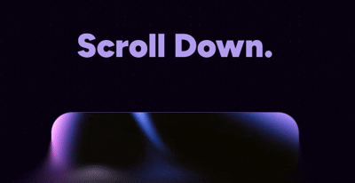

# GradualBlur



Create beautiful gradual blur effects that fade smoothly from clear to blurred. Perfect for hero sections, navigation overlays, and modern UI designs. Now with enhanced presets, target-aware positioning, and improved responsive design.

## Installation

```bash
# For command line usage
npm install -g gradualblur

# For React/Vue/Svelte projects
npm install gradualblur
```

## Quick Start

### Command Line

```bash
# Basic blur at bottom of screen
gradual-blur

# Top blur preset
gradual-blur --preset top

# Bottom blur preset
gradual-blur --preset bottom
```

### React

```jsx
import GradualBlur from 'gradualblur';

function App() {
  return (
    <div>
      {/* Simple bottom blur */}
      <GradualBlur />
      
      {/* Bottom blur with animation */}
      <GradualBlur 
        preset="bottom"
        animated="fade"
      />
      
      {/* Custom blur with hover effect */}
      <GradualBlur 
        position="top"
        strength={3}
        hoverIntensity={2}
      />
    </div>
  );
}
```

## Common Options

| Option | What it does | Example |
|--------|-------------|----------|
| `--preset top` | Top blur preset | `gradual-blur --preset top` |
| `--preset bottom` | Bottom blur preset | `gradual-blur --preset bottom` |
| `--position left` | Blur from left side | `gradual-blur --position left --width 6rem` |
| `--strength 3` | Make blur stronger | `gradual-blur --strength 3` |
| `--height 10rem` | Change blur area height | `gradual-blur --height 10rem` |
| `--animated scroll` | Blur appears when scrolling | `gradual-blur --animated scroll` |
| `--relative` | Use relative positioning | `gradual-blur --relative` |

## Presets

Enhanced presets for common use cases:

**Basic Positions**
```bash
gradual-blur --preset top        # Top edge blur
gradual-blur --preset bottom     # Bottom edge blur  
gradual-blur --preset left       # Left side blur
gradual-blur --preset right      # Right side blur
```

**Intensity Variations**
```bash
gradual-blur --preset subtle     # Subtle, light blur
gradual-blur --preset intense    # Strong, dramatic blur
```

**Style Variations**
```bash
gradual-blur --preset smooth     # Smooth bezier curve
gradual-blur --preset sharp      # Sharp linear transition
```

**Common Use Cases**
```bash
gradual-blur --preset header     # Header navigation blur
gradual-blur --preset footer     # Footer section blur
gradual-blur --preset sidebar    # Side panel blur
```

**Page-Level Blurs**
```bash
gradual-blur --preset page-header  # Full-page header blur
gradual-blur --preset page-footer  # Full-page footer blur
```

## Animations

**Scroll Animation**
```bash
gradual-blur --animated scroll
```
Blur appears when element comes into view.

**Hover Effect**
```bash
gradual-blur --animated hover --hover-intensity 2
```
Blur gets stronger when you hover over it.

**Fade In**
```bash
gradual-blur --animated fade
```
Blur fades in smoothly when page loads.

## Responsive Design

```bash
# Different heights for different screen sizes
gradual-blur --responsive --mobile-height 3rem --desktop-height 8rem
```

## Positioning

### Target-Aware Positioning

Choose between page-level or parent-level positioning:

```bash
# Page-level blur (fixed positioning, covers entire viewport)
gradual-blur --target page --position bottom

# Parent-level blur (relative positioning, within parent container)
gradual-blur --target parent --position bottom
```

### Side Blur Effects

```bash
# Left side blur
gradual-blur --position left --width 6rem

# Right side blur  
gradual-blur --position right --width 6rem
```

### Legacy Positioning (Deprecated)

```bash
# Fixed positioning (legacy - use --target page instead)
gradual-blur --position bottom

# Relative positioning (legacy - use --target parent instead)
gradual-blur --relative --position bottom
```

## Framework Usage

### Vue.js

```vue
<template>
  <GradualBlur preset="top" animated="scroll" />
</template>

<script>
import { GradualBlurVue as GradualBlur } from 'gradualblur'
export default {
  components: { GradualBlur }
}
</script>
```

### Svelte

```svelte
<script>
  import { GradualBlurSvelte as GradualBlur } from 'gradualblur'
</script>

<GradualBlur preset="bottom" animated="fade" />
```

### Vanilla JavaScript

```html
<!-- Simple HTML setup -->
<div data-gradual-blur data-gradual-blur-preset="bottom"></div>

<!-- Or with JavaScript -->
<script>
import { GradualBlurJS } from 'gradualblur'

const blur = new GradualBlurJS('.my-element', {
  preset: 'top',
  animated: 'scroll'
})
</script>
```

## Real-World Examples

**Landing Page Hero**
```bash
gradual-blur --preset bottom --animated fade --height 8rem
```

**Floating Navigation**
```bash
gradual-blur --preset top --animated scroll
```

**Side Panel Blur**
```bash
gradual-blur --position left --width 5rem --strength 2
```

**Custom Blur**
```bash
gradual-blur --position bottom --height 10rem --strength 3 --curve bezier
```

## Browser Support

Works in all modern browsers that support `backdrop-filter`:
- Chrome 76+
- Firefox 103+
- Safari 9+
- Edge 79+

## Tips

- Start with presets, then customize as needed
- Use `--strength 1-3` for most cases (higher = more blur)
- Add `--animated scroll` for modern feel
- Use custom CSS backgrounds for color overlays
- Test on mobile with `--responsive`

## License

MIT © Ansh Dhanani
